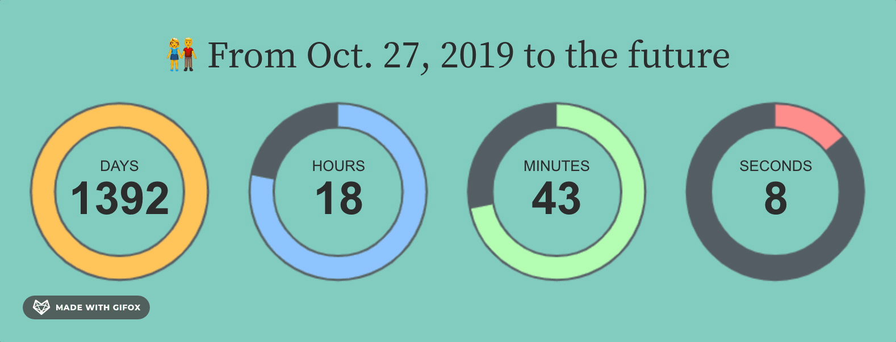
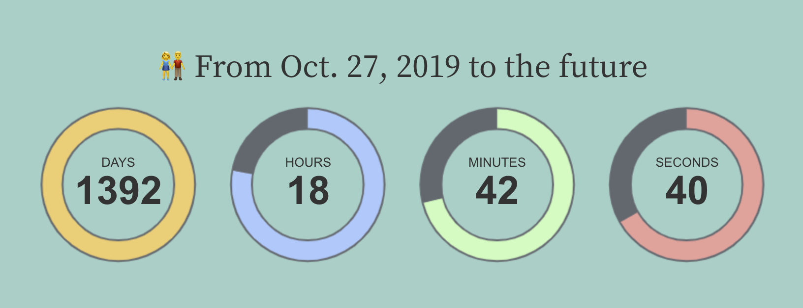
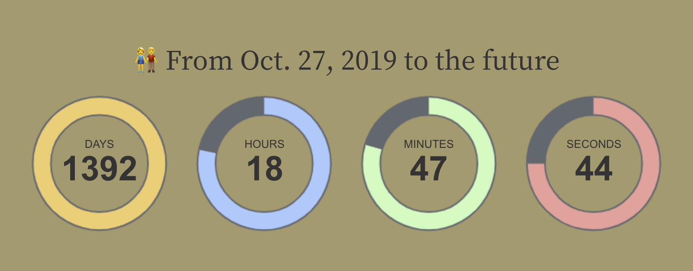
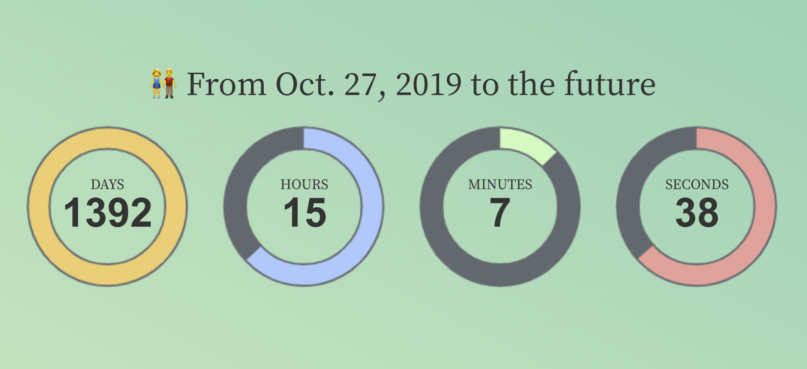

# lovingtimer: Create a loving timer in Stata

爱意东升西落，浪漫至死不渝。值此七夕佳节，给大家分享一个有趣的 Stata 命令。是我特意为今年七夕编写的～



使用该命令可以 1s 中生成这样的一个「恋爱计时器」。

## 安装 lovingtimer 命令

这个命令被我放到了 GitHub 上，因此大家可以运行下面的代码安装：

```stata
net install lovingtimer.pkg, from("https://r-stata.github.io/lovingtimer_stata/") replace 
```

另外也可以下载后安装：

```stata
net install lovingtimer.pkg, from("lovingtimer_stata 文件夹的路径") replace 
```

## 运行 lovingtimer 命令

然后运行 lovingtimer 命令就可以创建一个恋爱计时器了：

```stata
lovingtimer, title("👫 From Oct. 27, 2019 to the future") firstday(2019-10-27 23:00:00) 
```

该命令会创建一个 html 文件放在工作目录下：`lovingtimer.html`，也可以使用 savehtml() 选项自定义文件名字。



## 设置字体

由于懒得写 hlp 帮助文档，所以我习惯直接在 ado 里面写帮助文档，运行 `which lovingtimer` 即可查看：

```stata
which lovingtimer 

*! 在 Stata 中创建一个恋爱计时器
*! 微信公众号 RStata 2023 年 8 月 20 日
*! 【用法】：
*!              lovingtimer string, [TItle(string) FIrstday(string) BGColor(string) TITLEFontfamily(string) TIMERFontfamily(string) SPANFontfamily(string) SAVEhtml(string)]
*! 【选项】：
*!              title: Title.
*!              firstday: The first day of love. For example, "2023-01-01 01:00:00".
*!              bgcolor: background-color.
*!              titlefontfamily: Title font family.
*!              timerfontfamily: Timer font family.
*!              spanfontfamily: Font for numbers.
*!              savehtml: file name to be saved.
*! 【示例】：
*!      lovingtimer, ti("From the first day to the future") firstday "2023-01-01 01:00:00" 
```

其中选项中的大写部分表示该选项可以简写成大写部分对应的字母，例如更改背景色：

```stata
lovingtimer, title("👫 From Oct. 27, 2019 to the future") ///
  firstday(2019-10-27 23:00:00) ///
  bgc("#AC9969")
```



其中 firstday 就是你和你的爱人在一起的第一天了，title 可以用来设置标题。

这里的字体名称比较灵活，可以设置单个，也可以设置多个（实际上是为了避免某些浏览器不支持个别字体，准备的备选字体），例如 spanfontfamily 的默认值是 "Helvetica,Arial,sans-serif"。

## 高级设置：CSS

lovingtimer 命令会创建一个 html 文件，这个文件可以用记事本或者其他文本编辑器打开：

```html
<!DOCTYPE HTML>
<html>
<head>
    <title>Loving timer</title>
    <script type='text/javascript' src='https://tidyfriday.cn/loving-timer/static/jquery.min.js'></script>
    <script type='text/javascript' src='https://tidyfriday.cn/loving-timer/static/TimeCircles.js'></script>
    <link rel='stylesheet' href='https://tidyfriday.cn/loving-timer/static/bootstrap.min.css'>
    <link rel='stylesheet' href='https://tidyfriday.cn/loving-timer/static/TimeCircles.css'>
    <style>
        body {
            -webkit-font-smoothing: antialiased;
            font-family: Helvetica Neue, Helvetica, Hiragino Sans GB, Microsoft YaHei, Arial, sans-serif;
            background-color: #AC9969;
        }
        .container {
            width: 800px;
            height: 340px;
            position: absolute;
            left: 50%;
            top: 50%;
            margin-left: -400px;
            margin-top: -170px;
        }
        h2 {
            text-align: center;
            font-family: Source Han Serif;
        }
        h4 {
            text-align: center;
            font-family: Source Han Serif;
        }
        span {
            text-align: center;
            font-family: Helvetica,Arial,sans-serif;
        }
    </style>
</head>
<body>
    <div class='container'>
        <div class='content'>
            <h2>👫 From Oct. 27, 2019 to the future</h2>
            <div id='DateCountdown' data-date='2019-10-27 23:00:00'></div>
        </div>
    </div>
    <script>$('#DateCountdown').TimeCircles();</script>
</body>
</html>
```

如果你还会一些 CSS，就可以继续深入的设置这个计时器了，例如给计时器的背景换个颜色，使用渐变色背景（仿照下面的代码修改上面的 html 代码）：

```css
body {
    -webkit-font-smoothing: antialiased;
    font-family: Helvetica Neue, Helvetica, Hiragino Sans GB, Microsoft YaHei, Arial, sans-serif;
    background-color: #AC9969;
    background: linear-gradient(to bottom left, #47C9AF 0%, #D9F5BE 100%) 100% no-repeat !important;height:1000px;
}
```



也可以使用图片作为背景，注意要选择长宽恰当的图片：

```css
body {
    -webkit-font-smoothing: antialiased;
    font-family: Helvetica Neue, Helvetica, Hiragino Sans GB, Microsoft YaHei, Arial, sans-serif;
    background-color: #AC9969;
    background-image: url("./bgpic.png");
}
```


## 祝天下有情人终成眷属

记住两个人相爱过程中那些重要的日子或许就是最好的礼物了，祝大家有情终成眷属，爱情美满，事业有成！七夕佳节快乐～
